# Prism Virtual Firewall — Architecture Diagrams

Comprehensive architecture diagrams for the Prism DPU-accelerated virtual firewall,
covering production deployment topology, component internals, traffic flows, multi-tenant
isolation, PoC-to-production gap, and control plane interactions.

---

## 1. Production Multi-Tenant Deployment Diagram

Multiple tenants share a single Tier 3 host running Prism. Each tenant has workloads on
Tier 1 hosts with their own BF3 DPUs. Traffic is steered through the Clos fabric to the
shared Prism instance on Tier 3, keyed on VXLAN VNI per tenant.

```
 TIER 1 — TENANT HOSTS                    FABRIC              TIER 3 — SHARED SERVICES
 ========================                  ======              =========================

 ┌─────────────────────┐                                      ┌─────────────────────────────────────┐
 │ Tenant A Workloads  │                                      │  Tier 3 Host (512C, 1TB RAM)        │
 │  VM1   VM2   VM3    │                                      │                                     │
 │   │     │     │     │                                      │  ┌─────────────────────────────┐    │
 │ ┌─┴─────┴─────┴──┐  │                                      │  │    Prism VM (16 cores)      │    │
 │ │ BF3 DPU (VNI=A)│  │     ┌─────────────┐                 │  │  DPDK + Conntrack + ACL     │    │
 │ │ eSwitch         │──┼────▶│             │                 │  │  Admin VF │ In VF │ Out VF  │    │
 │ │ encap VXLAN     │  │     │             │                 │  └─────┬─────┴───┬───┴────┬────┘    │
 │ └─────────────────┘  │     │   Clos /    │                 │        │Blue     │Green   │Green/Red│
 └─────────────────────┘     │  Fat-Tree   │                 │  ┌─────┴─────────┴────────┴────┐    │
                              │   Fabric    │                 │  │  BF3 DPU (Tier 3)           │    │
 ┌─────────────────────┐     │  (400G      │                 │  │  eSwitch + Session Table     │    │
 │ Tenant B Workloads  │     │   Leaf/     │                 │  │  ┌────────────────────────┐  │    │
 │  VM4   VM5   VM6    │     │   Spine)    │                 │  │  │ HW Session Table       │  │    │
 │   │     │     │     │     │             │                 │  │  │  VNI_A + 5-tuple → FWD │  │    │
 │ ┌─┴─────┴─────┴──┐  │     │             │                 │  │  │  VNI_B + 5-tuple → FWD │  │    │
 │ │ BF3 DPU (VNI=B)│──┼────▶│             │────────────────▶│  │  │  VNI_C + 5-tuple → DRP │  │    │
 │ │ eSwitch         │  │     │             │                 │  │  └────────────────────────┘  │    │
 │ │ encap VXLAN     │  │     │             │                 │  │  Offload daemon (ARM, gRPC)  │    │
 │ └─────────────────┘  │     │             │                 │  └──────────────────────────────┘    │
 └─────────────────────┘     │             │                 │                                     │
                              │             │                 │  Also on this host:                  │
 ┌─────────────────────┐     │             │                 │   - NAT Gateway                     │
 │ Tenant C Workloads  │     │             │                 │   - Load Balancer                   │
 │  VM7   VM8          │     │             │                 │   - DNS/DHCP Anchors                │
 │   │     │           │     │             │                 │   - Nexus (separate DPU)            │
 │ ┌─┴─────┴────────┐  │     │             │                 └─────────────────────────────────────┘
 │ │ BF3 DPU (VNI=C)│──┼────▶│             │
 │ │ eSwitch         │  │     └─────────────┘
 │ │ encap VXLAN     │  │
 │ └────────────────┘  │
 └─────────────────────┘

 Legend:
   VNI = VXLAN Network Identifier (unique per tenant VPC)
   Each tenant's traffic is isolated by VNI in both overlay and session table
   Overlapping CIDRs (e.g., 10.0.0.0/8) across tenants are safe — VNI disambiguates
```

---

## 2. Single-Host Component Diagram (Production)

Detailed view of one Tier 3 host running Prism, showing PCIe topology, VF mapping,
and DPU internals.

```
┌─────────────────────────────────────────────────────────────────────────────────┐
│                        TIER 3 HOST (2-socket, 512 cores, 1TB RAM)               │
│                                                                                  │
│  NUMA Node 0                                                                     │
│  ┌────────────────────────────────────────────────────────────────────────────┐  │
│  │                                                                            │  │
│  │  ┌──────────────────────────────────────────────────┐                      │  │
│  │  │         PRISM VM  (QEMU/Cloud Hypervisor)        │                      │  │
│  │  │                                                  │                      │  │
│  │  │  ┌────────────┐  ┌──────────┐  ┌──────────┐     │                      │  │
│  │  │  │ Admin VF   │  │  In VF   │  │  Out VF  │     │  Resources:          │  │
│  │  │  │ (Blue)     │  │ (Green)  │  │(Grn/Red) │     │   16 pinned cores    │  │
│  │  │  │ VFIO pass  │  │ VFIO pass│  │VFIO pass │     │   32-64 GB (1G HPs)  │  │
│  │  │  └─────┬──────┘  └────┬─────┘  └────┬─────┘     │   100 GB SSD         │  │
│  │  │        │               │              │           │                      │  │
│  │  │  ┌─────┴───────────────┴──────────────┴─────┐    │                      │  │
│  │  │  │        DPDK Poll-Mode Driver              │    │                      │  │
│  │  │  │   (zero-copy, RSS 8+ queues, batched)     │    │                      │  │
│  │  │  └───────────────────┬───────────────────────┘    │                      │  │
│  │  │                      │                            │                      │  │
│  │  │  ┌───────────────────┴───────────────────────┐    │                      │  │
│  │  │  │     Inspection Pipeline                   │    │                      │  │
│  │  │  │  ┌─────────┐ ┌──────┐ ┌───────────────┐  │    │                      │  │
│  │  │  │  │Conntrack│→│ ACL  │→│ Classification │  │    │                      │  │
│  │  │  │  │ (state) │ │(L3/4)│ │  (L7 future)  │  │    │                      │  │
│  │  │  │  └─────────┘ └──────┘ └───────┬───────┘  │    │                      │  │
│  │  │  │                                │          │    │                      │  │
│  │  │  │           Verdict: ALLOW/DENY/OFFLOAD     │    │                      │  │
│  │  │  └───────────────────────────────────────────┘    │                      │  │
│  │  └──────────────────────────────────────────────────┘                      │  │
│  │                                                                            │  │
│  │         ▲ VF0 (Blue)    ▲ VF1 (In)      ▲ VF2 (Out)                       │  │
│  │         │ PCIe          │ PCIe           │ PCIe                            │  │
│  │         │               │                │                                 │  │
│  │  ┌──────┴───────────────┴────────────────┴──────────────────────────────┐  │  │
│  │  │                    BlueField-3 DPU (PCIe attached)                    │  │  │
│  │  │                                                                      │  │  │
│  │  │  ┌────────────────────────────────────────────────────────────┐      │  │  │
│  │  │  │                    eSwitch (ASAP2)                         │      │  │  │
│  │  │  │                                                            │      │  │  │
│  │  │  │  ┌─────────────────────────────────────────────────────┐   │      │  │  │
│  │  │  │  │   Hardware Session Table (2-16M entries)            │   │      │  │  │
│  │  │  │  │   Match: VNI + src_ip + dst_ip + proto + ports     │   │      │  │  │
│  │  │  │  │   Action: FWD to Out VF | DROP | METER              │   │      │  │  │
│  │  │  │  └─────────────────────────────────────────────────────┘   │      │  │  │
│  │  │  │                                                            │      │  │  │
│  │  │  │  Miss (new flow) ──────────────────────▶ In VF (to VM)    │      │  │  │
│  │  │  │  Hit (offloaded) ──────────────────────▶ Out VF / Drop    │      │  │  │
│  │  │  └────────────────────────────────────────────────────────────┘      │  │  │
│  │  │                                                                      │  │  │
│  │  │  ┌────────────────────────────────┐   ┌──────────────────────┐      │  │  │
│  │  │  │  ARM A78 Cores (16)           │   │  Uplinks (2x100G)    │      │  │  │
│  │  │  │  ┌──────────────────────────┐ │   │  ┌────┐    ┌────┐    │      │  │  │
│  │  │  │  │ Offload Daemon (gRPC)    │ │   │  │ P0 │    │ P1 │    │      │  │  │
│  │  │  │  │ - receives offload reqs  │ │   │  └──┬─┘    └──┬─┘    │      │  │  │
│  │  │  │  │ - programs session table │ │   │     │          │      │      │  │  │
│  │  │  │  │ - handles flush commands │ │   │     └────┬─────┘      │      │  │  │
│  │  │  │  └──────────────────────────┘ │   │          │ to fabric  │      │  │  │
│  │  │  │  ┌──────────────────────────┐ │   └──────────┼────────────┘      │  │  │
│  │  │  │  │ SDN Agent (overlay)      │ │              │                    │  │  │
│  │  │  │  └──────────────────────────┘ │              │                    │  │  │
│  │  │  └────────────────────────────────┘              │                    │  │  │
│  │  └──────────────────────────────────────────────────┼────────────────────┘  │  │
│  │                                                     │                       │  │
│  └─────────────────────────────────────────────────────┼───────────────────────┘  │
│                                                        │                          │
│                                                        ▼ To Clos Fabric           │
└─────────────────────────────────────────────────────────────────────────────────────┘
```

---

## 3. Traffic Flow — New Connection (Slow Path)

A new flow from a tenant workload that has not been seen before. The Prism VM inspects
and makes a verdict.

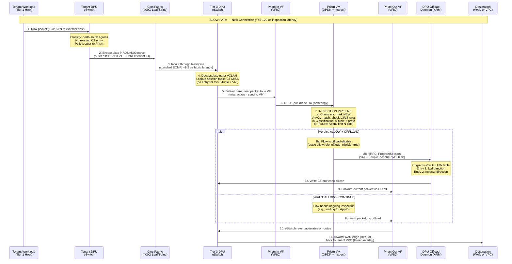

---

## 4. Traffic Flow — Established Connection (Fast Path)

An offloaded flow. The Prism VM is completely bypassed — zero CPU involvement.

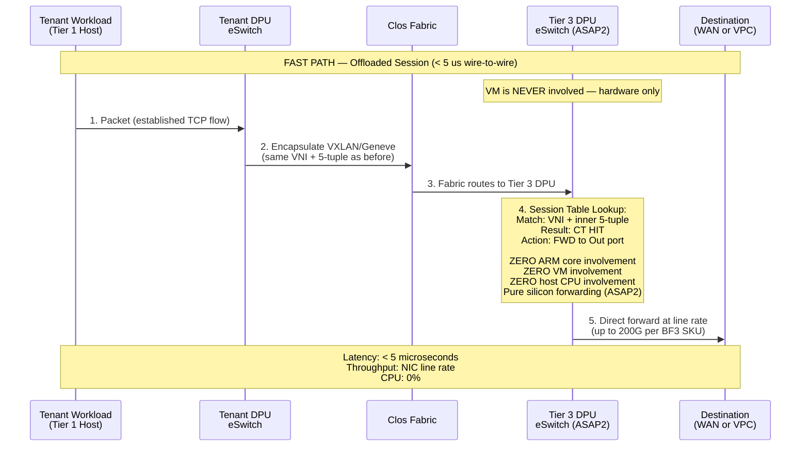

---

## 5. Traffic Flow — Denied Connection

A flow that matches a DENY rule. No session entry is created, so all subsequent packets
for this flow continue hitting the slow path and being dropped.

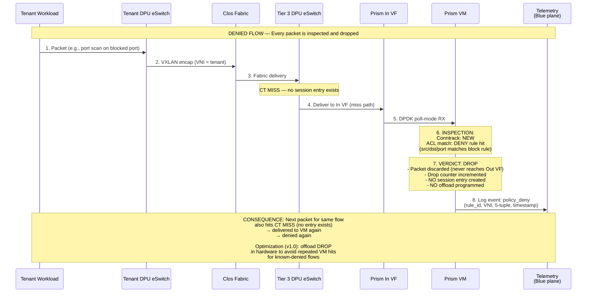

**Denied flow with hardware drop offload (v1.0 optimization):**

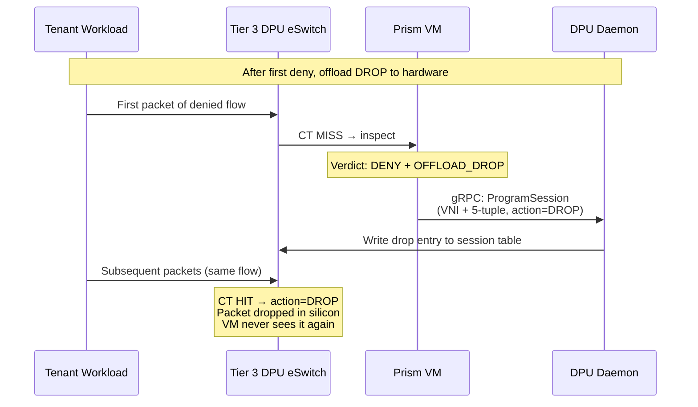

---

## 6. Multi-Tenant Isolation Model

How multiple tenants sharing a single Prism instance are kept isolated.

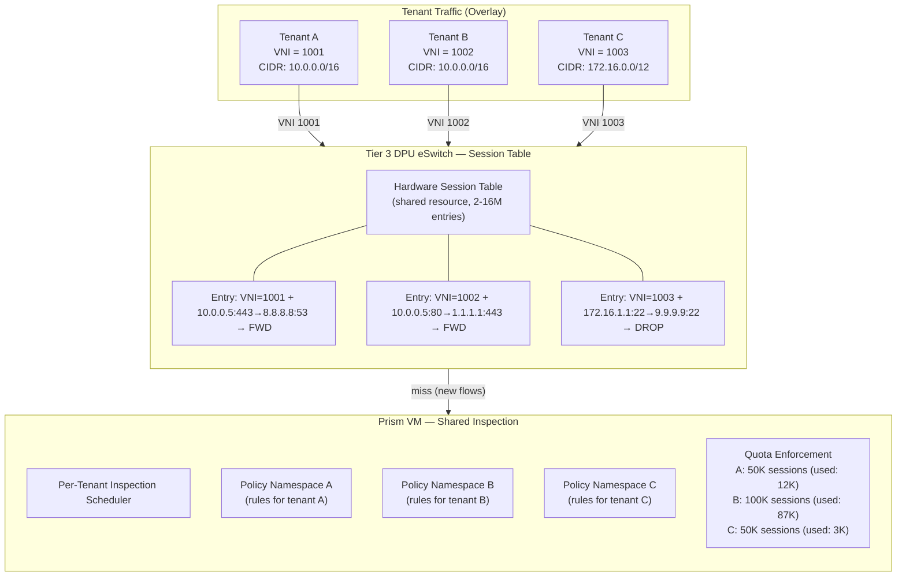

### Isolation Mechanisms

```
 ISOLATION LAYER           MECHANISM                      STRENGTH
 ═══════════════════════════════════════════════════════════════════════════
 1. Network Identity       VNI (VXLAN Network ID)         Hardware — eSwitch
                           per tenant VPC                 silicon enforces VNI
                                                          match on every lookup

 2. Session Table Keys     Match key = VNI + 5-tuple      Hardware — tenant A's
                           VNI is MANDATORY in key         sessions cannot match
                                                          tenant B's packets
                                                          (different VNI)

 3. Overlapping CIDRs      Two tenants can both use       Safe: VNI disambiguates
                           10.0.0.0/24 internally          10.0.0.5 in VNI=1001
                                                          ≠ 10.0.0.5 in VNI=1002

 4. Policy Namespaces      Per-tenant rule sets in        Software — Prism VM
                           Prism VM inspection engine      applies only the rules
                                                          for the packet's VNI

 5. Session Quotas         Per-tenant max entries in      Software — Prism refuses
                           the shared HW session table    to offload past quota
                           (API: QUOTA_EXCEEDED 429)       (protects shared resource)

 6. Rate Limiting          Per-tenant new-flow rate       Hardware — DPU meter on
                           limit at eSwitch miss path     miss path before VM
                           (noisy-neighbor protection)

 7. Plane Separation       Admin API on Blue plane        Network — Green/Blue
                           unreachable from Green          physically isolated;
                           tenant cannot reach mgmt       tenant cannot probe API
```

---

## 7. PoC to Production Gap Diagram

What the PoC has proven, what changes for production, and what stays the same.

```mermaid
flowchart LR
    subgraph POC["PoC (Current State)"]
        direction TB
        P1["tc-flower rules<br/>(kernel TC subsystem)"]
        P2["Single-host topology<br/>(HPE x86 + 1 BF3)"]
        P3["148 Gbps measured<br/>(in_hw=true offload)"]
        P4["Stateless allow/deny<br/>(no conntrack)"]
        P5["REST API on DPU<br/>(Flask, port 8443)"]
        P6["No VM — all on DPU<br/>(ARM or tc from host)"]
        P7["2 VFs (pf0vf0, pf0vf3)<br/>(internet + client)"]
        P8["No multi-tenancy<br/>(single namespace)"]
    end

    subgraph SAME["Same Principle"]
        direction TB
        S1["BF3 eSwitch silicon<br/>does the forwarding"]
        S2["Software decides,<br/>hardware executes"]
        S3["Zero CPU on fast path"]
        S4["Policy-driven offload"]
    end

    subgraph PROD["Production Target"]
        direction TB
        D1["DOCA Flow CT API<br/>(hardware conntrack)"]
        D2["Multi-host overlay<br/>(VXLAN/Geneve fabric)"]
        D3["100 Gbps aggregate<br/>(80% offload ratio)"]
        D4["Stateful L3/L4<br/>(connection tracking)"]
        D5["Admin API on Blue VF<br/>(gRPC/REST, mTLS)"]
        D6["Inspection VM on x86<br/>(16 cores, DPDK, hugepages)"]
        D7["3 VFs per Prism<br/>(Admin + In + Out, VFIO)"]
        D8["Per-VNI isolation<br/>(multi-tenant, quotas)"]
    end

    POC --> SAME
    SAME --> PROD
```

### Detailed Gap Table

```
 ASPECT              POC (proven)                PRODUCTION (target)           GAP
 ═══════════════════════════════════════════════════════════════════════════════════════════
 Offload API         tc-flower (kernel TC)       DOCA Flow CT (userspace)      Replace stack
 Conntrack           None (stateless)            DOCA CT + Prism conntrack     New component
 Decision engine     tc rules on DPU             DPDK VM on x86 (16 cores)     New VM + DPDK
 Interface model     2 VFs (in + out)            3 VFs (admin + in + out)      Add Blue VF
 Multi-tenancy       None                        VNI-keyed, per-tenant policy  New logic
 Throughput          148 Gbps (raw offload)      100 Gbps (with inspection)    Lower but OK
 Inspection depth    None (passthrough)          L3/L4 ACL + CT state          New pipeline
 Control plane       REST on DPU (:8443)         Blue-plane API (mTLS, gRPC)   New API
 HA / Failover       None (single instance)      Warm standby → active-active  New mechanism
 Observability       Basic counters              OTel, gNMI, per-flow metrics  New pipeline
 Hardware            Same BF3 DPU                Same BF3 DPU                  NONE
 Principle           SW decides, HW forwards     SW decides, HW forwards       NONE
```

---

## 8. API / Control Plane Diagram

How the control plane manages Prism through the Blue management network.

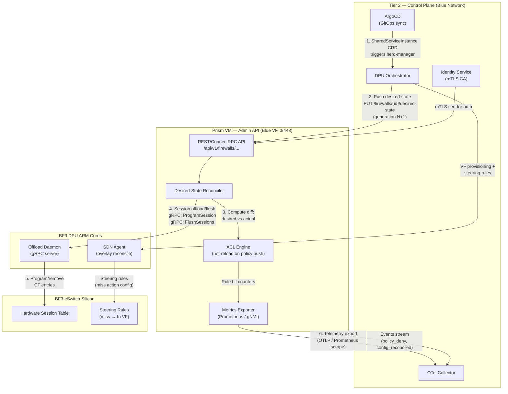

### Policy Push Sequence (Desired-State Reconciliation)

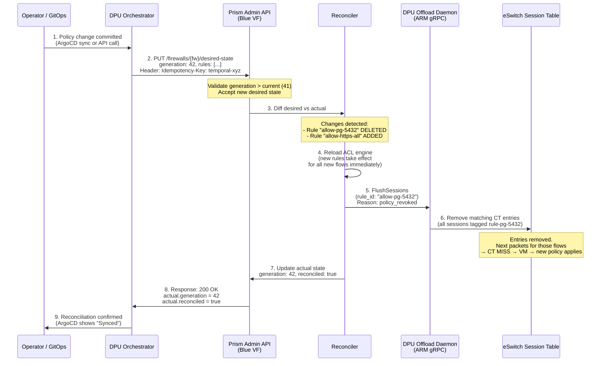

### Metrics and Alerting

```
 METRIC                              ALERT CONDITION          ACTION
 ═══════════════════════════════════════════════════════════════════════════
 flow_table_utilization_percent      > 80% warn, > 95% crit  Scale out (add Prism)
 offload_hit_rate_percent            < 50% warn              Investigate flow churn
 inspected_throughput_bps            > 40 Gbps warn          Approaching VM capacity
 reconcile_lag_ms                    > 5000 ms crit          Reconciler stalled
 dpu_arm_core_utilization_percent    > 85% warn              DPU overloaded
 sessions_per_second_new             Anomaly spike           Possible DDoS / churn
 drops_policy_deny_rate              Anomaly spike           Possible attack

 Export paths:
   Prism VM ──[OTLP/Blue]──▶ OTel Collector ──▶ Prometheus ──▶ Grafana
   DPU ARM  ──[gNMI/Blue]──▶ OTel Collector ──▶ Prometheus ──▶ Grafana
```

---

## Appendix: Key Numbers

| Parameter | Value |
|-----------|-------|
| PoC measured throughput | 148 Gbps (tc-flower, in_hw=true) |
| Production aggregate target | 100 Gbps (with inspection VM in loop) |
| Fast-path latency (offloaded) | < 5 microseconds |
| Slow-path latency (inspection) | 45-120 microseconds |
| Offload ratio target | 70-80% of flows by volume |
| VM cores | 16 dedicated, pinned, NUMA-aligned |
| VM memory | 32-64 GB (1 GB hugepages) |
| Session table capacity | 2-16M entries (BF3 firmware dependent) |
| VFs per Prism instance | 3 (Admin + In + Out) |
| DPUs per Tier 3 host | 2-4 (NUMA locality + redundancy) |
| Recovery SLO (v1.0) | < 15 seconds (restart), < 5 seconds (warm standby) |
| BF3 SKU | B3220 (2x100G, ConnectX-7 based) |
| Fail mode default | Fail-closed (new flows dropped) |

---

## 9. Per-Tenant Firewall VM Model (Production)

Each tenant gets their own dedicated firewall VM because:
- Each tenant owns public IP(s) — the firewall IS the tenant's internet gateway
- The firewall binds the public IP on its In (Red) interface
- DDoS isolation: one tenant's flood doesn't affect others
- Independent scaling: heavy tenants get more cores
- Clean 3-interface model per tenant (In=Red/Internet, Out=Green/Private, Mgmt=Blue)

### Deployment Layout (Single Tier 3 Host)

```
Tier 3 Host (512 cores, 1TB RAM, 2-4 BF3 DPUs)
═══════════════════════════════════════════════════════════════════

  ┌───────────────────┐  ┌───────────────────┐  ┌───────────────────┐
  │  Tenant A FW VM   │  │  Tenant B FW VM   │  │  Tenant C FW VM   │
  │  4 cores, 8GB     │  │  4 cores, 8GB     │  │  2 cores, 4GB     │
  │                   │  │                   │  │                   │
  │  In VF (Red)      │  │  In VF (Red)      │  │  In VF (Red)      │
  │   ├─ Public IP:   │  │   ├─ Public IP:   │  │   ├─ Public IP:   │
  │   │  1.2.3.4      │  │   │  5.6.7.8      │  │   │  9.10.11.12   │
  │   │  1.2.3.5      │  │   │               │  │   │               │
  │                   │  │                   │  │                   │
  │  Out VF (Green)   │  │  Out VF (Green)   │  │  Out VF (Green)   │
  │   └─ Tenant VLAN/ │  │   └─ Tenant VLAN/ │  │   └─ Tenant VLAN/ │
  │      VNI=10100    │  │      VNI=10200    │  │      VNI=10300    │
  │                   │  │                   │  │                   │
  │  Mgmt VF (Blue)   │  │  Mgmt VF (Blue)   │  │  Mgmt VF (Blue)   │
  │   └─ 10.99.A.1    │  │   └─ 10.99.B.1    │  │   └─ 10.99.C.1    │
  │                   │  │                   │  │                   │
  │  DPDK pipeline:   │  │  DPDK pipeline:   │  │  DPDK pipeline:   │
  │  Conntrack → ACL  │  │  Conntrack → ACL  │  │  Conntrack → ACL  │
  │  → Offload to DPU │  │  → Offload to DPU │  │  → Offload to DPU │
  └─────────┬─────────┘  └─────────┬─────────┘  └─────────┬─────────┘
            │ 3 VFs                 │ 3 VFs                 │ 3 VFs
  ══════════╪═══════════════════════╪═══════════════════════╪══════════
            │ PCIe (VFIO passthrough)                       │
  ┌─────────┴───────────────────────┴───────────────────────┴─────────┐
  │                       BF3 DPU eSwitch                              │
  │                                                                    │
  │  Session Table (per-tenant entries):                               │
  │    Tenant A: (pub_ip=1.2.3.4, 5-tuple) → FWD to Out VF-A          │
  │    Tenant B: (pub_ip=5.6.7.8, 5-tuple) → FWD to Out VF-B          │
  │    Tenant C: (pub_ip=9.10.11.12, 5-tuple) → FWD to Out VF-C       │
  │                                                                    │
  │  New flows (CT MISS) → delivered to correct tenant's In VF         │
  │  Offloaded flows (CT HIT) → bypass tenant VM entirely             │
  │                                                                    │
  │  Offload Daemon (ARM):                                             │
  │    Receives gRPC from ALL tenant VMs                               │
  │    Programs shared session table with per-tenant entries            │
  └────────────────────────────────────────────────────────────────────┘
            │
     ═══════╪═══════  Fabric → Edge Router → Internet
            │
     Public IPs announced via BGP from Edge Router
     Routed to specific DPU uplink based on destination IP
```

### Traffic Flow — Ingress (Internet → Tenant)

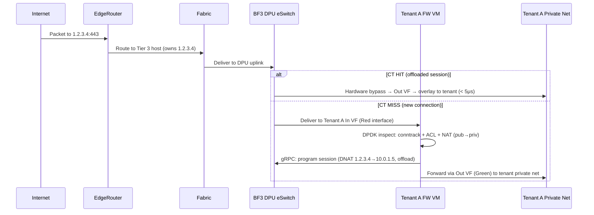

### Traffic Flow — Egress (Tenant → Internet)

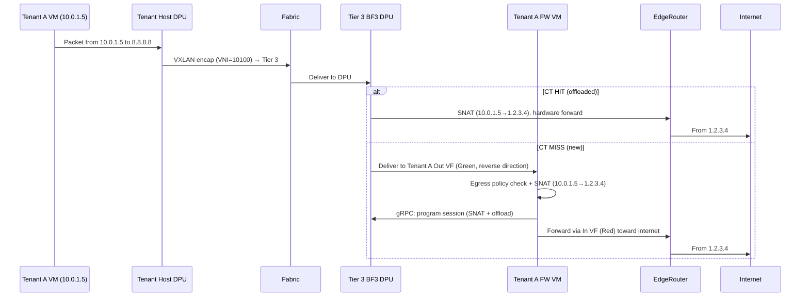

### Scale Calculations

| Resource | Per Tenant | Per DPU (250 VFs) | Per Host (2 DPUs) |
|----------|-----------|-------------------|-------------------|
| VFs | 3 (In + Out + Mgmt) | 83 tenants | 166 tenants |
| CPU cores | 2-4 (DPDK pinned) | — | 166 × 3 = 498 cores (fits 512) |
| RAM | 4-8 GB (hugepages) | — | 166 × 6 GB = 996 GB (fits 1TB) |
| Session table entries | ~50K per tenant | 4M per DPU | 8M per host |
| Bandwidth (offloaded) | Up to 100 Gbps | 200 Gbps line rate | 400 Gbps |

---

## 10. High Availability — Standard vs Premium Tenants

### Standard Tenants: Cold Failover (3-10 seconds)

For most tenants, HA is a cold failover model:

```
NORMAL:
  Host-A: [Tenant-1 VM] [Tenant-2 VM] [Tenant-3 VM] ...
  Host-B: [Tenant-50 VM] [Tenant-51 VM] ...

HOST-A DIES:
  1. herd-manager detects failure (health check, 1-2s)
  2. herd-manager selects Host-C (has capacity)
  3. herd-manager tells Host-C herd-handler: "boot Tenant-1,2,3 VMs"
  4. Host-C: allocate VFs, bind VFIO, boot VM with Cloud Hypervisor (~5s)
  5. DPU Orchestrator: re-program DPU on Host-C to steer traffic
  6. Edge Router: update routes (BGP withdraw from Host-A, announce from Host-C)
  7. Total failover: ~8-15 seconds
  8. Session state: LOST (all connections reset, TCP retransmits within 3s)
```

```
Timeline:
  t=0s    Host-A power failure
  t=1-2s  herd-manager detects (missed 3 health checks @ 500ms)
  t=2-3s  Scheduling decision (select Host-C)
  t=3-8s  VM boot (Cloud Hypervisor + VFIO VF attach + DPDK init)
  t=8-10s DPU steering update + BGP route propagation
  t=10s   Traffic flowing to new VM
  
  Impact: 8-15 second disruption. All TCP sessions reset.
  Acceptable for: web servers, APIs, non-realtime workloads.
```

### Premium Tenants: Active-Standby (Sub-Second Failover)

For premium tenants (paying for HA SLA), deploy an active-standby pair:

```
NORMAL OPERATION:
  ┌─────────────────────────────────────────────────────────────────┐
  │                                                                 │
  │  Host-A                          Host-B                         │
  │  ┌─────────────────────┐         ┌─────────────────────┐       │
  │  │ Tenant-X FW VM      │         │ Tenant-X FW VM      │       │
  │  │ (ACTIVE)            │         │ (STANDBY)           │       │
  │  │                     │         │                     │       │
  │  │ Public IP: 1.2.3.4  │         │ (ready, no traffic) │       │
  │  │ Processing traffic   │────────▶│ Session replication  │       │
  │  │                     │ sync    │ (receives CT state)  │       │
  │  └─────────────────────┘         └─────────────────────┘       │
  │         ▲                                                       │
  │         │ traffic                                               │
  │         │                                                       │
  └─────────┼───────────────────────────────────────────────────────┘
            │
      Edge Router (BGP: 1.2.3.4 → Host-A DPU)
```

```
FAILOVER (Host-A dies):
  ┌─────────────────────────────────────────────────────────────────┐
  │                                                                 │
  │  Host-A (DEAD)                   Host-B                         │
  │  ┌─────────────────────┐         ┌─────────────────────┐       │
  │  │        ████████████ │         │ Tenant-X FW VM      │       │
  │  │        ██ FAILED ██ │         │ (NOW ACTIVE)        │       │
  │  │        ████████████ │         │                     │       │
  │  │                     │         │ Public IP: 1.2.3.4  │       │
  │  │                     │         │ Session table: warm  │       │
  │  │                     │         │ (replicated state)   │       │
  │  └─────────────────────┘         └─────────────────────┘       │
  │                                          ▲                      │
  │                                          │ traffic              │
  └──────────────────────────────────────────┼──────────────────────┘
                                             │
      Edge Router (BGP: 1.2.3.4 → Host-B DPU now)
```

#### Active-Standby Components:

1. **Session Replication** (continuous):
   - Active VM streams CT state changes to Standby via dedicated sync channel (Blue plane)
   - Protocol: gRPC stream of (5-tuple, state, NAT mapping, offload status)
   - Bandwidth: ~1-10 Mbps per tenant (depends on new flow rate)
   - Standby maintains warm session table (not programming DPU yet)

2. **Health Monitoring**:
   - Standby pings Active every 100ms via Blue plane
   - 3 missed pings = failover trigger (300ms detection)
   - OR: DPU-level BFD (Bidirectional Forwarding Detection) at 50ms intervals

3. **Failover Sequence** (sub-second):
```
Timeline:
  t=0ms     Host-A failure
  t=100-300ms  Standby detects (missed pings)
  t=300-400ms  Standby promotes to Active
  t=400-500ms  Standby programs DPU session table from replicated state
  t=500-600ms  DPU Orchestrator updates DPU steering rules
  t=600-800ms  Edge Router BGP update (or GARP for L2 failover)
  t=800ms   Traffic flowing to new Active
  
  Impact: <1 second disruption. Most TCP sessions survive (no reset).
  Session table was pre-replicated — offloaded flows resume immediately.
```

4. **Cost per Premium Tenant**:
   - 2× VM resources (active + standby)
   - 2× VFs consumed (6 instead of 3)
   - Dedicated sync bandwidth on Blue plane
   - Price: ~2× standard tenant

#### Session Replication Detail:

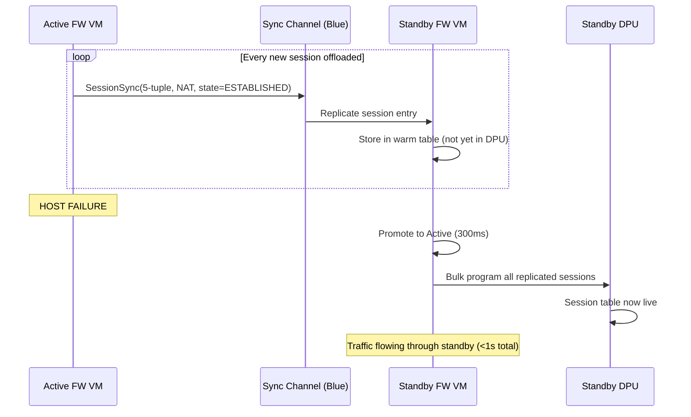

### Comparison Table

| Feature | Standard Tenant | Premium Tenant (Active-Standby) |
|---------|----------------|-------------------------------|
| Failover time | 8-15 seconds | <1 second |
| Session survival | No (all reset) | Yes (replicated) |
| Resource cost | 1× (3 VFs, 2-4 cores) | 2× (6 VFs, 4-8 cores) |
| DDoS isolation | Yes | Yes |
| RPO (data loss) | Last few seconds of flows | Near-zero (continuous replication) |
| RTO (recovery time) | 8-15s | <1s |
| Monthly cost multiplier | 1× | ~2-2.5× |
| Suitable for | Web, APIs, dev/test | Databases, real-time, financial |

---

## 11. Orchestration — Who Manages All This?

```
┌─────────────────────────────────────────────────────────────────┐
│                    CONTROL PLANE                                  │
│                                                                  │
│  ┌─────────────┐  ┌──────────────┐  ┌──────────────────────┐   │
│  │ Tenant API  │  │ herd-manager │  │  DPU Orchestrator     │   │
│  │ (user-facing)│  │ (VM lifecycle)│  │  (eSwitch steering)  │   │
│  └──────┬──────┘  └──────┬───────┘  └──────────┬───────────┘   │
│         │                 │                      │               │
│         │  "Create FW     │  "Boot VM on        │  "Steer VNI   │
│         │   for tenant"   │   Host-A with       │   to VF-pair  │
│         │                 │   3 VFs"            │   on DPU-X"   │
│         ▼                 ▼                      ▼               │
│  ┌──────────────────────────────────────────────────────────┐   │
│  │              Temporal Workflow Engine                       │   │
│  │  (orchestrates multi-step provisioning with retries)       │   │
│  └──────────────────────────────────────────────────────────┘   │
└─────────────────────────────────────────────────────────────────┘
         │                    │                      │
         ▼                    ▼                      ▼
    ┌──────────┐       ┌───────────┐         ┌───────────────┐
    │ Prism    │       │ herd-     │         │ DPU Agent     │
    │ Admin API│       │ handler   │         │ (per DPU)     │
    │ (per VM) │       │ (per host)│         │               │
    │ :8443    │       │           │         │ Programs      │
    │ Blue     │       │ Boot VM,  │         │ eSwitch,      │
    │ plane    │       │ attach VFs│         │ session table │
    └──────────┘       └───────────┘         └───────────────┘
```
