# Prism Virtual Firewall — Architecture Diagrams

Comprehensive architecture diagrams for the Prism DPU-accelerated virtual firewall,
covering production deployment topology, component internals, traffic flows, multi-tenant
isolation, PoC-to-production gap, and control plane interactions.

**Core Model:** Each tenant gets their OWN dedicated Prism firewall VM. Tenants own their
public IP(s) — the firewall VM binds them on its In (Red) interface. One shared offload
daemon on DPU ARM cores serves all tenant VMs on that DPU.

---

## 1. Production Multi-Tenant Deployment Diagram

Multiple tenants each run a dedicated Prism firewall VM on a shared Tier 3 host.
Each tenant VM owns the tenant's public IP(s) and performs stateful inspection
independently. The DPU eSwitch is shared infrastructure — its session table holds
per-flow entries keyed on (public_ip + 5-tuple), providing hardware-speed bypass
once flows are offloaded.

```
 INTERNET                     FABRIC              TIER 3 — FIREWALL HOST
 ========                     ======              =======================

                                                  ┌─────────────────────────────────────────────┐
 Public IPs announced                             │  Tier 3 Host (512C, 1TB RAM, 2 BF3 DPUs)    │
 via BGP from Edge Router                         │                                             │
                                                  │  ┌─────────────┐ ┌─────────────┐ ┌───────┐ │
 ┌──────────────┐                                 │  │ Tenant A VM │ │ Tenant B VM │ │Ten. C │ │
 │ Edge Router  │                                 │  │ 4C, 8GB     │ │ 4C, 8GB     │ │2C,4GB │ │
 │              │                                 │  │ Pub: 1.2.3.4│ │ Pub: 5.6.7.8│ │9.10.  │ │
 │ Announces:   │                                 │  │      1.2.3.5│ │             │ │ 11.12 │ │
 │  1.2.3.4/32  │                                 │  │             │ │             │ │       │ │
 │  1.2.3.5/32  │     ┌─────────────┐            │  │ In(Red) VF  │ │ In(Red) VF  │ │In VF  │ │
 │  5.6.7.8/32  │     │             │            │  │ Out(Grn) VF │ │ Out(Grn) VF │ │Out VF │ │
 │  9.10.11.12  │     │   Clos /    │            │  │ Mgmt(Blu)VF │ │ Mgmt(Blu)VF │ │Mgmt VF│ │
 │              │     │  Fat-Tree   │            │  └──────┬──────┘ └──────┬──────┘ └───┬───┘ │
 │  Routes to   │     │   Fabric    │            │         │3 VFs          │3 VFs       │3 VFs│
 │  Tier 3 VTEP │────▶│  (400G      │───────────▶│  ═══════╪══════════════╪════════════╪═════ │
 │              │     │   Leaf/     │            │  ┌──────┴──────────────┴────────────┴───┐  │
 └──────────────┘     │   Spine)    │            │  │         BF3 DPU #1 eSwitch           │  │
                      │             │            │  │                                      │  │
 TENANT PRIVATE NETS  │             │            │  │  Session Table (shared, 2-16M):      │  │
 ==================   │             │            │  │    (1.2.3.4, tcp, :443→X) → FWD A    │  │
                      │             │            │  │    (5.6.7.8, tcp, :80→Y)  → FWD B    │  │
 ┌──────────────┐     │             │            │  │    (9.10.11.12, tcp, :22→Z) → DROP   │  │
 │ Tenant A VMs │     │             │            │  │                                      │  │
 │ (Tier 1)     │────▶│             │            │  │  Offload Daemon (ARM):               │  │
 │ 10.0.0.0/16  │     │             │            │  │    gRPC server for ALL tenant VMs    │  │
 └──────────────┘     │             │            │  │    Programs shared session table      │  │
                      │             │            │  └──────────────────────────────────────┘  │
 ┌──────────────┐     │             │            │                                           │
 │ Tenant B VMs │────▶│             │            │  Also on this host:                       │
 │ (Tier 1)     │     │             │            │   - NAT Gateway (separate)                │
 │ 10.0.0.0/16  │     │             │            │   - Load Balancer (separate DPU)          │
 └──────────────┘     │             │            │   - DNS/DHCP Anchors                      │
                      │             │            │   - Nexus (separate DPU)                   │
 ┌──────────────┐     │             │            └───────────────────────────────────────────┘
 │ Tenant C VMs │────▶│             │
 │ (Tier 1)     │     └─────────────┘
 │ 172.16.0.0/12│
 └──────────────┘

 Legend:
   Each tenant VM owns its public IPs — binds them on In (Red) VF
   Overlapping private CIDRs safe — traffic keyed on public IP + VF identity
   One DPU offload daemon serves ALL tenant VMs via shared gRPC endpoint
   83 tenants per DPU (250 VFs / 3), 166 per host with 2 DPUs
```

---

## 2. Single-Host Component Diagram (Production)

Detailed view of one Tier 3 host running multiple per-tenant Prism VMs, showing
PCIe topology, VF triplet mapping, and the shared DPU offload daemon.

```
┌────────────────────────────────────────────────────────────────────────────────────────┐
│                      TIER 3 HOST (2-socket, 512 cores, 1TB RAM)                         │
│                                                                                         │
│  NUMA Node 0                                                                            │
│  ┌────────────────────────────────────────────────────────────────────────────────────┐ │
│  │                                                                                    │ │
│  │  ┌──────────────────────┐  ┌──────────────────────┐  ┌──────────────────────┐     │ │
│  │  │  Tenant A FW VM      │  │  Tenant B FW VM      │  │  Tenant C FW VM      │     │ │
│  │  │  (QEMU/CH, 4 cores)  │  │  (QEMU/CH, 4 cores)  │  │  (QEMU/CH, 2 cores)  │     │ │
│  │  │                      │  │                      │  │                      │     │ │
│  │  │  ┌────┐ ┌───┐ ┌───┐ │  │  ┌────┐ ┌───┐ ┌───┐ │  │  ┌────┐ ┌───┐ ┌───┐ │     │ │
│  │  │  │Mgmt│ │ In│ │Out│ │  │  │Mgmt│ │ In│ │Out│ │  │  │Mgmt│ │ In│ │Out│ │     │ │
│  │  │  │Blue│ │Red│ │Grn│ │  │  │Blue│ │Red│ │Grn│ │  │  │Blue│ │Red│ │Grn│ │     │ │
│  │  │  └──┬─┘ └─┬─┘ └─┬─┘ │  │  └──┬─┘ └─┬─┘ └─┬─┘ │  │  └──┬─┘ └─┬─┘ └─┬─┘ │     │ │
│  │  │     │     │     │   │  │     │     │     │   │  │     │     │     │   │     │ │
│  │  │  ┌──┴─────┴─────┴─┐ │  │  ┌──┴─────┴─────┴─┐ │  │  ┌──┴─────┴─────┴─┐ │     │ │
│  │  │  │ DPDK PMD       │ │  │  │ DPDK PMD       │ │  │  │ DPDK PMD       │ │     │ │
│  │  │  │ (poll-mode)    │ │  │  │ (poll-mode)    │ │  │  │ (poll-mode)    │ │     │ │
│  │  │  └───────┬────────┘ │  │  └───────┬────────┘ │  │  └───────┬────────┘ │     │ │
│  │  │          │           │  │          │           │  │          │           │     │ │
│  │  │  ┌───────┴────────┐ │  │  ┌───────┴────────┐ │  │  ┌───────┴────────┐ │     │ │
│  │  │  │ Conntrack→ACL  │ │  │  │ Conntrack→ACL  │ │  │  │ Conntrack→ACL  │ │     │ │
│  │  │  │ → Verdict      │ │  │  │ → Verdict      │ │  │  │ → Verdict      │ │     │ │
│  │  │  └────────────────┘ │  │  └────────────────┘ │  │  └────────────────┘ │     │ │
│  │  │  Pub: 1.2.3.4/.5   │  │  Pub: 5.6.7.8       │  │  Pub: 9.10.11.12    │     │ │
│  │  └───────────┬─────────┘  └───────────┬─────────┘  └───────────┬─────────┘     │ │
│  │              │ VF0,VF1,VF2            │ VF3,VF4,VF5            │ VF6,VF7,VF8   │ │
│  │              │ PCIe VFIO              │ PCIe VFIO              │ PCIe VFIO     │ │
│  │  ┌───────────┴────────────────────────┴────────────────────────┴─────────────┐ │ │
│  │  │                      BlueField-3 DPU (PCIe attached)                       │ │ │
│  │  │                                                                            │ │ │
│  │  │  ┌──────────────────────────────────────────────────────────────────────┐  │ │ │
│  │  │  │                      eSwitch (ASAP2)                                 │  │ │ │
│  │  │  │                                                                      │  │ │ │
│  │  │  │  ┌─────────────────────────────────────────────────────────────┐     │  │ │ │
│  │  │  │  │   Hardware Session Table (2-16M entries, SHARED)            │     │  │ │ │
│  │  │  │  │                                                             │     │  │ │ │
│  │  │  │  │   Match: dst_ip + src_ip + dst_port + src_port + proto      │     │  │ │ │
│  │  │  │  │   Per-tenant entries (keyed on flow, not on VNI):           │     │  │ │ │
│  │  │  │  │     (1.2.3.4:443←X) → FWD to Tenant A Out VF               │     │  │ │ │
│  │  │  │  │     (5.6.7.8:80←Y)  → FWD to Tenant B Out VF               │     │  │ │ │
│  │  │  │  │     (9.10.11.12:22←Z) → DROP                                │     │  │ │ │
│  │  │  │  └─────────────────────────────────────────────────────────────┘     │  │ │ │
│  │  │  │                                                                      │  │ │ │
│  │  │  │  Miss (new flow) → route to correct tenant's In VF by dst IP        │  │ │ │
│  │  │  │  Hit (offloaded) → bypass that tenant's VM entirely                 │  │ │ │
│  │  │  └──────────────────────────────────────────────────────────────────────┘  │ │ │
│  │  │                                                                            │ │ │
│  │  │  ┌──────────────────────────────┐   ┌───────────────────────────────────┐  │ │ │
│  │  │  │  ARM A78 Cores (16)         │   │  Uplinks (2x100G)                 │  │ │ │
│  │  │  │  ┌────────────────────────┐ │   │  ┌────┐    ┌────┐                 │  │ │ │
│  │  │  │  │ Offload Daemon (gRPC)  │ │   │  │ P0 │    │ P1 │                 │  │ │ │
│  │  │  │  │ - ONE daemon for ALL   │ │   │  └──┬─┘    └──┬─┘                 │  │ │ │
│  │  │  │  │   tenant VMs           │ │   │     │          │                   │  │ │ │
│  │  │  │  │ - receives gRPC from   │ │   │     └────┬─────┘                   │  │ │ │
│  │  │  │  │   each VM's pipeline   │ │   │          │ to fabric/edge          │  │ │ │
│  │  │  │  │ - programs session tbl │ │   └──────────┼─────────────────────────┘  │ │ │
│  │  │  │  └────────────────────────┘ │              │                            │ │ │
│  │  │  │  ┌────────────────────────┐ │              │                            │ │ │
│  │  │  │  │ SDN Agent (overlay)    │ │              │                            │ │ │
│  │  │  │  └────────────────────────┘ │              │                            │ │ │
│  │  │  └──────────────────────────────┘              │                            │ │ │
│  │  └────────────────────────────────────────────────┼────────────────────────────┘ │ │
│  │                                                   │                              │ │
│  └───────────────────────────────────────────────────┼──────────────────────────────┘ │
│                                                      │                                │
│                                                      ▼ To Clos Fabric / Edge Router   │
└────────────────────────────────────────────────────────────────────────────────────────┘
```

---

## 3. Traffic Flow — New Connection (Slow Path)

A new inbound connection to Tenant A's public IP (1.2.3.4). The packet arrives from
the internet, the DPU has no session entry, so it delivers to Tenant A's firewall VM
for inspection. On ALLOW, Tenant A's VM requests offload via the shared daemon.

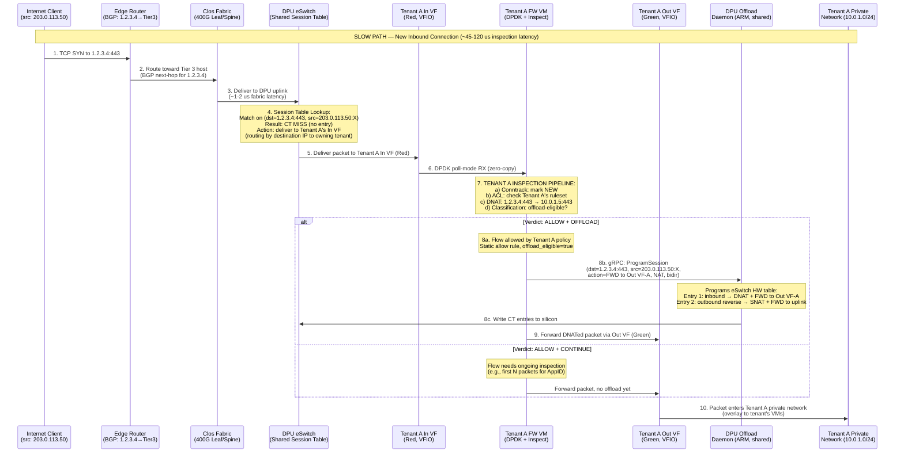

---

## 4. Traffic Flow — Established Connection (Fast Path)

An offloaded flow to Tenant A's public IP. Tenant A's firewall VM is completely
bypassed — zero CPU involvement. The DPU performs NAT and forwarding in silicon.

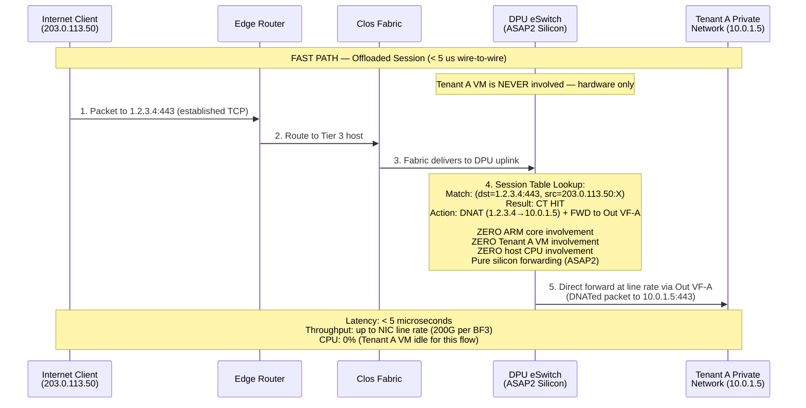

**Return path (Tenant A → Internet) also offloaded:**

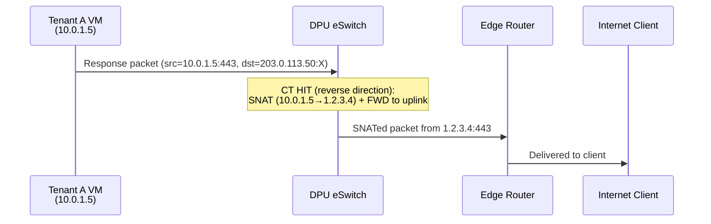

---

## 5. Traffic Flow — Denied Connection

A flow that matches a DENY rule in Tenant A's policy. The packet is inspected by
Tenant A's VM and dropped. No session entry is created initially, so subsequent
packets continue hitting the slow path until a DROP is offloaded.

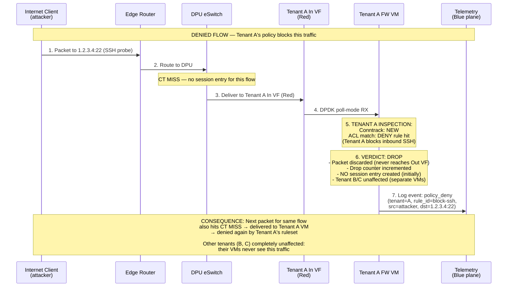

**Denied flow with hardware drop offload (v1.0 optimization):**

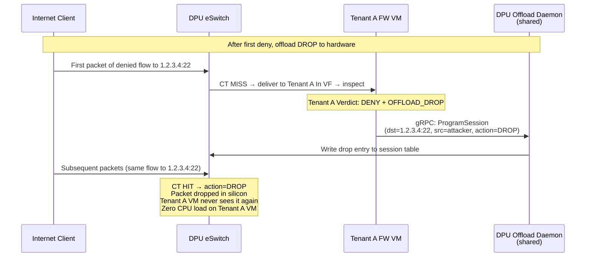

---

## 6. Multi-Tenant Isolation Model

How multiple tenants are isolated: each tenant runs in its OWN VM with its own
inspection pipeline, and the shared DPU session table contains per-flow entries
that cannot cross tenant boundaries.

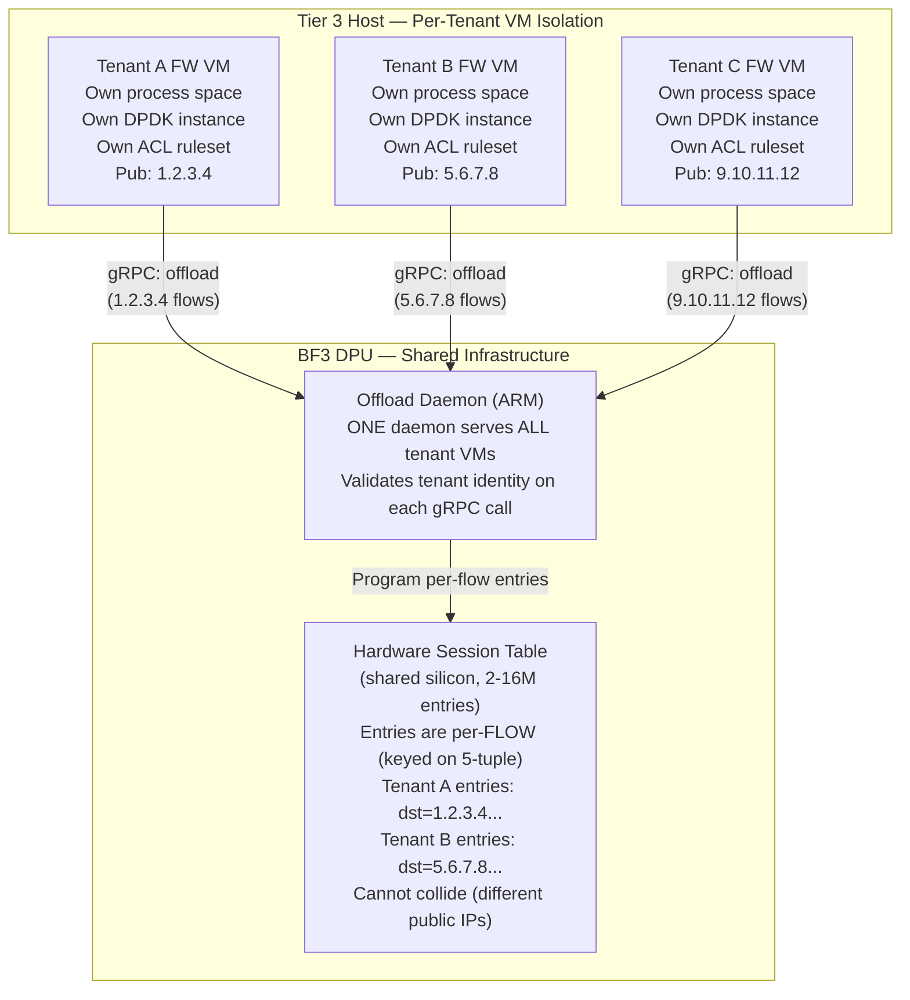

### Isolation Mechanisms

```
 ISOLATION LAYER           MECHANISM                      STRENGTH
 ═══════════════════════════════════════════════════════════════════════════
 1. Process Isolation      Each tenant = separate VM      Hardware — QEMU/CH
                           Own kernel, own memory space    process boundary;
                           No shared state with others     one tenant crash
                                                          cannot affect another

 2. VF Isolation           3 dedicated VFs per tenant     Hardware — PCIe SR-IOV
                           (In/Red + Out/Green + Mgmt/Blue) VFIO passthrough;
                           IOMMU enforced separation       DMA isolation

 3. Public IP Ownership    Each tenant owns distinct       Network — traffic to
                           public IP(s); FW binds them     1.2.3.4 can ONLY reach
                           on its In (Red) VF              Tenant A's In VF

 4. Session Table Keys     Match key = (public_ip +       Hardware — Tenant A's
                           5-tuple); different tenants     sessions use 1.2.3.4;
                           have different public IPs       Tenant B's use 5.6.7.8;
                                                          physically cannot match

 5. Offload Daemon Auth    Daemon validates tenant ID     Software — VM presents
                           on each ProgramSession call;   mTLS cert identifying
                           refuses cross-tenant entries    tenant; daemon rejects
                                                          IP ownership mismatch

 6. Session Quotas         Per-tenant max entries in      Software — daemon refuses
                           the shared HW session table    to program past quota
                           (API: QUOTA_EXCEEDED 429)       (protects shared resource)

 7. Rate Limiting          Per-VF miss rate limit at      Hardware — DPU meter on
                           eSwitch (noisy-neighbor)       per-VF miss path;
                                                          one tenant's flood
                                                          cannot starve others

 8. Plane Separation       Mgmt API on Blue VF only       Network — Green/Blue
                           unreachable from Red or Green   physically isolated;
                           tenant workloads cannot reach    attackers on Red cannot
                           admin interface                 probe tenant's mgmt API
```

---

## 7. PoC to Production Gap Diagram

What the PoC has proven (single "tenant" with tc-flower), what changes for production
(N tenants with per-VM DOCA CT offload), and what fundamental principles remain.

```mermaid
flowchart LR
    subgraph POC["PoC (Current State)"]
        direction TB
        P1["tc-flower rules<br/>(kernel TC subsystem)"]
        P2["Single-host topology<br/>(HPE x86 + 1 BF3)"]
        P3["148 Gbps measured<br/>(in_hw=true offload)"]
        P4["Stateless allow/deny<br/>(no conntrack)"]
        P5["REST API on DPU<br/>(Flask, port 8443)"]
        P6["No VM — all on DPU<br/>(ARM or tc from host)"]
        P7["2 VFs (pf0vf0, pf0vf3)<br/>(internet + client)"]
        P8["1 'tenant' only<br/>(single namespace)"]
    end

    subgraph SAME["Same Principle"]
        direction TB
        S1["BF3 eSwitch silicon<br/>does the forwarding"]
        S2["Software decides,<br/>hardware executes"]
        S3["Zero CPU on fast path"]
        S4["Policy-driven offload"]
    end

    subgraph PROD["Production Target"]
        direction TB
        D1["DOCA Flow CT API<br/>(hardware conntrack)"]
        D2["Multi-host fabric<br/>(Clos leaf/spine)"]
        D3["Per-tenant bandwidth<br/>(100 Gbps offloaded)"]
        D4["Stateful L3/L4 per VM<br/>(per-tenant conntrack)"]
        D5["Admin API per VM<br/>(Blue VF, mTLS, gRPC)"]
        D6["Per-tenant FW VM on x86<br/>(2-4 cores, DPDK, HPs)"]
        D7["3 VFs PER TENANT<br/>(In/Red + Out/Green + Mgmt/Blue)"]
        D8["83 tenants per DPU<br/>(250 VFs / 3 = 83)"]
    end

    POC --> SAME
    SAME --> PROD
```

### Detailed Gap Table

```
 ASPECT              POC (proven)                PRODUCTION (target)           GAP
 ═══════════════════════════════════════════════════════════════════════════════════════════
 Offload API         tc-flower (kernel TC)       DOCA Flow CT (userspace)      Replace stack
 Conntrack           None (stateless)            Per-VM DOCA CT + SW CT        New component
 Decision engine     tc rules on DPU             Per-tenant DPDK VM (2-4C)     N VMs, not 1
 Interface model     2 VFs (in + out)            3 VFs PER TENANT (In+Out+Mgmt) N × 3 VFs
 Multi-tenancy       None (1 "tenant")           83 tenants/DPU, each own VM   Core change
 Throughput          148 Gbps (raw offload)      100 Gbps per tenant (offloaded) Per-tenant SLA
 Inspection depth    None (passthrough)          Per-VM L3/L4 ACL + CT state   New pipeline
 Control plane       REST on DPU (:8443)         Per-VM Blue-plane API (mTLS)  N API endpoints
 HA / Failover       None (single instance)      Per-tenant cold or active-stby New mechanism
 Observability       Basic counters              Per-VM OTel + shared metrics  New pipeline
 Offload daemon      N/A (tc-flower)             1 shared daemon, N VM clients New daemon
 Hardware            Same BF3 DPU                Same BF3 DPU                  NONE
 Principle           SW decides, HW forwards     SW decides, HW forwards       NONE
```

---

## 8. API / Control Plane Diagram

How the control plane manages per-tenant firewall VMs and the shared DPU offload
daemon through the Blue management network.

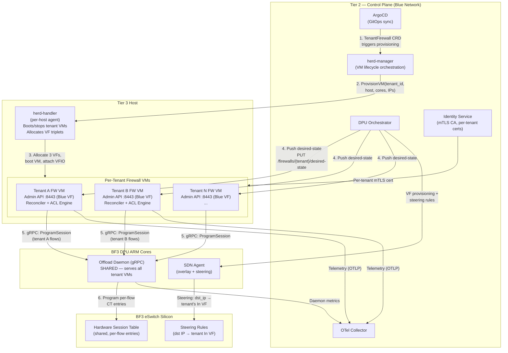

### Policy Push Sequence (Per-Tenant Desired-State Reconciliation)

Each tenant VM independently reconciles its own policy. The shared offload daemon
handles requests from all VMs but validates tenant ownership.

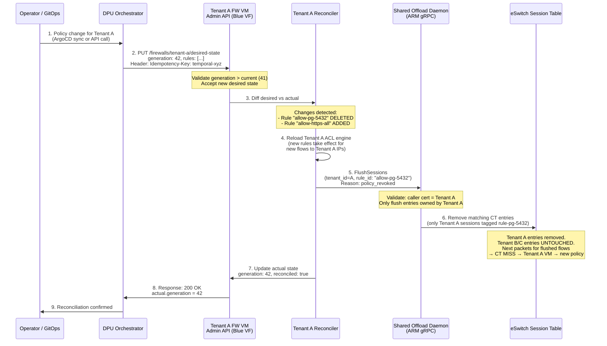

### Tenant VM Provisioning Sequence

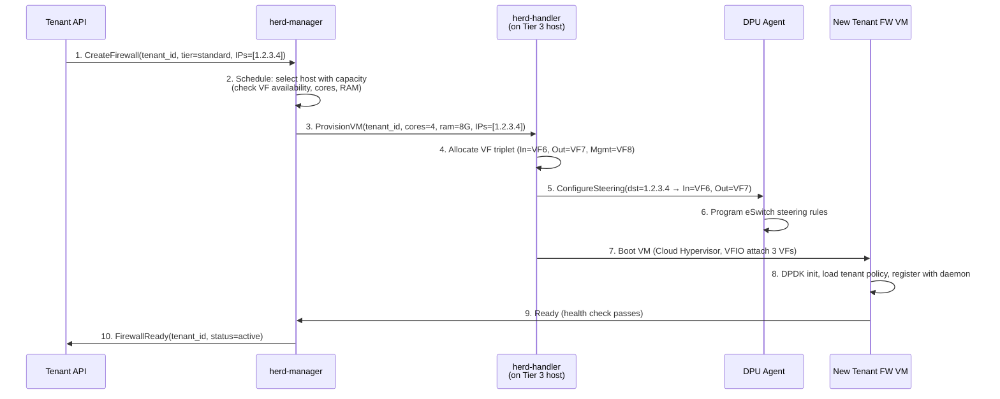

### Metrics and Alerting

```
 METRIC                              SCOPE           ALERT CONDITION          ACTION
 ═══════════════════════════════════════════════════════════════════════════════════════════
 flow_table_utilization_percent      Per-DPU         > 80% warn, > 95% crit  Redistribute tenants
 tenant_session_count                Per-tenant      > quota warn             Notify tenant
 offload_hit_rate_percent            Per-tenant      < 50% warn              Investigate churn
 inspected_throughput_bps            Per-VM          > VM capacity warn       Scale up VM cores
 reconcile_lag_ms                    Per-VM          > 5000 ms crit          Reconciler stalled
 dpu_arm_core_utilization_percent    Per-DPU         > 85% warn              Daemon overloaded
 tenant_vm_count                     Per-host        > 160 warn              Near host capacity
 vf_utilization                      Per-DPU         > 240/250 warn          Near VF limit

 Export paths:
   Each Tenant VM ──[OTLP/Blue]──▶ OTel Collector ──▶ Prometheus ──▶ Grafana
   Shared Daemon  ──[gNMI/Blue]──▶ OTel Collector ──▶ Prometheus ──▶ Grafana
   herd-handler   ──[OTLP/Blue]──▶ OTel Collector ──▶ Prometheus ──▶ Grafana
```

---

## 9. Per-Tenant Specifications

### Scale Calculations

| Resource | Per Tenant | Per DPU (250 VFs) | Per Host (2 DPUs) |
|----------|-----------|-------------------|-------------------|
| VFs | 3 (In + Out + Mgmt) | 83 tenants | 166 tenants |
| CPU cores | 2-4 (DPDK pinned) | — | 166 × 3 = 498 cores (fits 512) |
| RAM | 4-8 GB (hugepages) | — | 166 × 6 GB = 996 GB (fits 1TB) |
| Session table entries | ~50K per tenant | 4M per DPU | 8M per host |
| Bandwidth (offloaded) | Up to 100 Gbps | 200 Gbps line rate | 400 Gbps |

### VF Allocation Scheme

```
 DPU VF Index    Tenant    Interface    Purpose
 ════════════════════════════════════════════════════════════════
 VF0             Tenant 1  In (Red)     Internet-facing, binds public IP
 VF1             Tenant 1  Out (Green)  Tenant private network overlay
 VF2             Tenant 1  Mgmt (Blue)  Admin API, telemetry, sync
 VF3             Tenant 2  In (Red)     Internet-facing, binds public IP
 VF4             Tenant 2  Out (Green)  Tenant private network overlay
 VF5             Tenant 2  Mgmt (Blue)  Admin API, telemetry, sync
 ...             ...       ...          ...
 VF246           Tenant 83 In (Red)     Internet-facing, binds public IP
 VF247           Tenant 83 Out (Green)  Tenant private network overlay
 VF248           Tenant 83 Mgmt (Blue)  Admin API, telemetry, sync
 VF249           Reserved  —            DPU ARM management / spare
```

### Per-Tenant VM Sizing Tiers

| Tier | Cores | RAM | Max Sessions | Max Bandwidth | Use Case |
|------|-------|-----|--------------|---------------|----------|
| Small | 2 | 4 GB | 50K | 10 Gbps | Dev/test, small sites |
| Medium | 4 | 8 GB | 100K | 50 Gbps | Production web, APIs |
| Large | 8 | 16 GB | 200K | 100 Gbps | High-traffic, CDN origin |
| XL | 16 | 32 GB | 500K | 100 Gbps | Financial, real-time |

---

## 10. High Availability — Standard vs Premium Tenants

### Standard Tenants: Cold Failover (8-15 seconds)

For most tenants, HA is a cold failover model:

```
NORMAL:
  Host-A: [Tenant-1 VM] [Tenant-2 VM] [Tenant-3 VM] ...
  Host-B: [Tenant-50 VM] [Tenant-51 VM] ...

HOST-A DIES:
  1. herd-manager detects failure (health check, 1-2s)
  2. herd-manager selects Host-C (has capacity)
  3. herd-manager tells Host-C herd-handler: "boot Tenant-1,2,3 VMs"
  4. Host-C: allocate VFs, bind VFIO, boot VM with Cloud Hypervisor (~5s)
  5. DPU Orchestrator: re-program DPU on Host-C to steer traffic
  6. Edge Router: update routes (BGP withdraw from Host-A, announce from Host-C)
  7. Total failover: ~8-15 seconds
  8. Session state: LOST (all connections reset, TCP retransmits within 3s)
```

```
Timeline:
  t=0s    Host-A power failure
  t=1-2s  herd-manager detects (missed 3 health checks @ 500ms)
  t=2-3s  Scheduling decision (select Host-C)
  t=3-8s  VM boot (Cloud Hypervisor + VFIO VF attach + DPDK init)
  t=8-10s DPU steering update + BGP route propagation
  t=10s   Traffic flowing to new VM
  
  Impact: 8-15 second disruption. All TCP sessions reset.
  Acceptable for: web servers, APIs, non-realtime workloads.
```

### Premium Tenants: Active-Standby (Sub-Second Failover)

For premium tenants (paying for HA SLA), deploy an active-standby pair:

```
NORMAL OPERATION:
  ┌─────────────────────────────────────────────────────────────────┐
  │                                                                 │
  │  Host-A                          Host-B                         │
  │  ┌─────────────────────┐         ┌─────────────────────┐       │
  │  │ Tenant-X FW VM      │         │ Tenant-X FW VM      │       │
  │  │ (ACTIVE)            │         │ (STANDBY)           │       │
  │  │                     │         │                     │       │
  │  │ Public IP: 1.2.3.4  │         │ (ready, no traffic) │       │
  │  │ Processing traffic   │────────▶│ Session replication  │       │
  │  │                     │ sync    │ (receives CT state)  │       │
  │  └─────────────────────┘         └─────────────────────┘       │
  │         ▲                                                       │
  │         │ traffic                                               │
  │         │                                                       │
  └─────────┼───────────────────────────────────────────────────────┘
            │
      Edge Router (BGP: 1.2.3.4 → Host-A DPU)
```

```
FAILOVER (Host-A dies):
  ┌─────────────────────────────────────────────────────────────────┐
  │                                                                 │
  │  Host-A (DEAD)                   Host-B                         │
  │  ┌─────────────────────┐         ┌─────────────────────┐       │
  │  │        ████████████ │         │ Tenant-X FW VM      │       │
  │  │        ██ FAILED ██ │         │ (NOW ACTIVE)        │       │
  │  │        ████████████ │         │                     │       │
  │  │                     │         │ Public IP: 1.2.3.4  │       │
  │  │                     │         │ Session table: warm  │       │
  │  │                     │         │ (replicated state)   │       │
  │  └─────────────────────┘         └─────────────────────┘       │
  │                                          ▲                      │
  │                                          │ traffic              │
  └──────────────────────────────────────────┼──────────────────────┘
                                             │
      Edge Router (BGP: 1.2.3.4 → Host-B DPU now)
```

#### Active-Standby Components:

1. **Session Replication** (continuous):
   - Active VM streams CT state changes to Standby via dedicated sync channel (Blue plane)
   - Protocol: gRPC stream of (5-tuple, state, NAT mapping, offload status)
   - Bandwidth: ~1-10 Mbps per tenant (depends on new flow rate)
   - Standby maintains warm session table (not programming DPU yet)

2. **Health Monitoring**:
   - Standby pings Active every 100ms via Blue plane
   - 3 missed pings = failover trigger (300ms detection)
   - OR: DPU-level BFD (Bidirectional Forwarding Detection) at 50ms intervals

3. **Failover Sequence** (sub-second):
```
Timeline:
  t=0ms     Host-A failure
  t=100-300ms  Standby detects (missed pings)
  t=300-400ms  Standby promotes to Active
  t=400-500ms  Standby programs DPU session table from replicated state
  t=500-600ms  DPU Orchestrator updates DPU steering rules
  t=600-800ms  Edge Router BGP update (or GARP for L2 failover)
  t=800ms   Traffic flowing to new Active
  
  Impact: <1 second disruption. Most TCP sessions survive (no reset).
  Session table was pre-replicated — offloaded flows resume immediately.
```

4. **Cost per Premium Tenant**:
   - 2x VM resources (active + standby)
   - 2x VFs consumed (6 instead of 3)
   - Dedicated sync bandwidth on Blue plane
   - Price: ~2-2.5x standard tenant

#### Session Replication Detail:

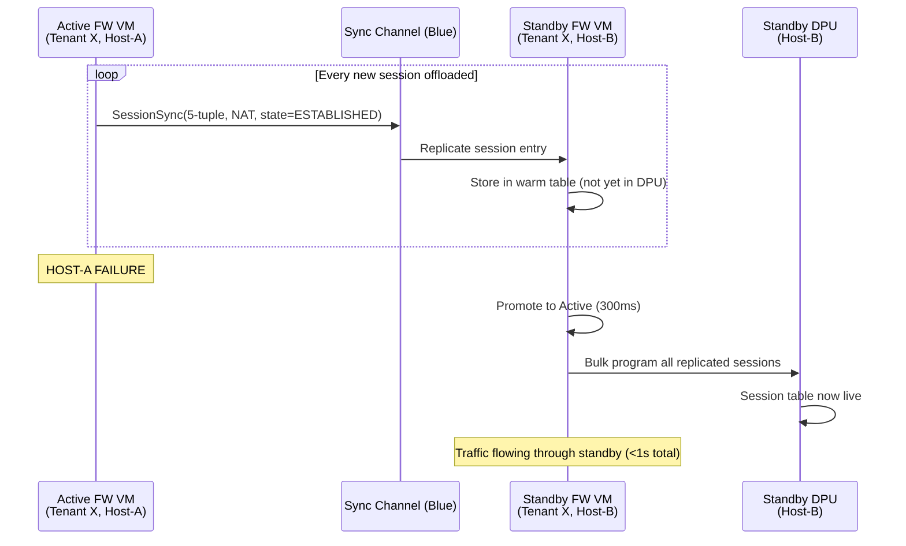

### Comparison Table

| Feature | Standard Tenant | Premium Tenant (Active-Standby) |
|---------|----------------|-------------------------------|
| Failover time | 8-15 seconds | <1 second |
| Session survival | No (all reset) | Yes (replicated) |
| Resource cost | 1x (3 VFs, 2-4 cores) | 2x (6 VFs, 4-8 cores) |
| DDoS isolation | Yes (own VM) | Yes (own VM pair) |
| RPO (data loss) | Last few seconds of flows | Near-zero (continuous replication) |
| RTO (recovery time) | 8-15s | <1s |
| Monthly cost multiplier | 1x | ~2-2.5x |
| Suitable for | Web, APIs, dev/test | Databases, real-time, financial |

---

## 11. Orchestration — Who Manages All This?

```
┌─────────────────────────────────────────────────────────────────┐
│                    CONTROL PLANE                                  │
│                                                                  │
│  ┌─────────────┐  ┌──────────────┐  ┌──────────────────────┐   │
│  │ Tenant API  │  │ herd-manager │  │  DPU Orchestrator     │   │
│  │ (user-facing)│  │ (VM lifecycle)│  │  (eSwitch steering)  │   │
│  └──────┬──────┘  └──────┬───────┘  └──────────┬───────────┘   │
│         │                 │                      │               │
│         │  "Create FW     │  "Boot VM on        │  "Steer pub   │
│         │   for tenant"   │   Host-A with       │   IP to VF    │
│         │                 │   3 VFs + pub IP"   │   on DPU-X"   │
│         ▼                 ▼                      ▼               │
│  ┌──────────────────────────────────────────────────────────┐   │
│  │              Temporal Workflow Engine                       │   │
│  │  (orchestrates multi-step provisioning with retries)       │   │
│  └──────────────────────────────────────────────────────────┘   │
└─────────────────────────────────────────────────────────────────┘
         │                    │                      │
         ▼                    ▼                      ▼
    ┌──────────┐       ┌───────────┐         ┌───────────────┐
    │ Prism    │       │ herd-     │         │ DPU Agent     │
    │ Admin API│       │ handler   │         │ (per DPU)     │
    │ (per VM) │       │ (per host)│         │               │
    │ :8443    │       │           │         │ Programs      │
    │ Blue VF  │       │ Boot VM,  │         │ eSwitch +     │
    │          │       │ attach 3  │         │ session table │
    │ Each     │       │ VFs per   │         │               │
    │ tenant   │       │ tenant,   │         │ Shared offload│
    │ has own  │       │ assign    │         │ daemon runs   │
    │ API      │       │ pub IPs   │         │ here          │
    └──────────┘       └───────────┘         └───────────────┘
```

### Provisioning Workflow (New Tenant)

```
1. Tenant API receives: CreateFirewall(tenant_id=acme, ips=[1.2.3.4], tier=medium)
2. herd-manager workflow:
   a. Select host with available capacity (VFs, cores, RAM)
   b. Reserve 3 VFs on target DPU
   c. Tell herd-handler: boot VM with (4 cores, 8GB, VF triplet, pub IPs)
   d. Tell DPU Orchestrator: steer 1.2.3.4 → In VF on this DPU
   e. Tell Edge Router: announce 1.2.3.4/32 via BGP (next-hop = Tier 3 VTEP)
   f. Wait for VM health check (DPDK up, daemon connected, policy loaded)
   g. Mark tenant firewall as ACTIVE
3. Traffic begins flowing through tenant's dedicated VM
```

### Deprovisioning Workflow (Remove Tenant)

```
1. Tenant API receives: DeleteFirewall(tenant_id=acme)
2. herd-manager workflow:
   a. Drain: flush all session table entries for tenant's IPs
   b. Edge Router: withdraw BGP announcement for 1.2.3.4/32
   c. Wait for drain (no new traffic arriving, ~5s)
   d. Tell herd-handler: stop VM, release VFs
   e. DPU Orchestrator: remove steering rules
   f. Release resources (VFs returned to pool, cores/RAM freed)
   g. Mark tenant firewall as DELETED
```

---

## Appendix: Key Numbers

| Parameter | Value |
|-----------|-------|
| PoC measured throughput | 148 Gbps (tc-flower, in_hw=true) |
| Production per-tenant offloaded target | 100 Gbps (with inspection VM in loop) |
| Fast-path latency (offloaded) | < 5 microseconds |
| Slow-path latency (inspection) | 45-120 microseconds |
| Offload ratio target | 70-80% of flows by volume |
| Tenants per DPU | 83 (250 VFs / 3) |
| Tenants per host (2 DPUs) | 166 |
| VM cores per tenant | 2-4 (DPDK pinned, NUMA-aligned) |
| VM memory per tenant | 4-8 GB (1 GB hugepages) |
| Session table capacity | 2-16M entries per DPU (shared) |
| VFs per tenant | 3 (In/Red + Out/Green + Mgmt/Blue) |
| DPUs per Tier 3 host | 2 (NUMA locality + redundancy) |
| Host spec | 512 cores, 1 TB RAM (Tier 3) |
| Offload daemon | 1 per DPU (shared, serves all tenant VMs) |
| Recovery SLO (Standard) | 8-15 seconds (cold failover) |
| Recovery SLO (Premium) | < 1 second (active-standby) |
| BF3 SKU | B3220 (2x100G, ConnectX-7 based) |
| Fail mode default | Fail-closed (new flows dropped) |
